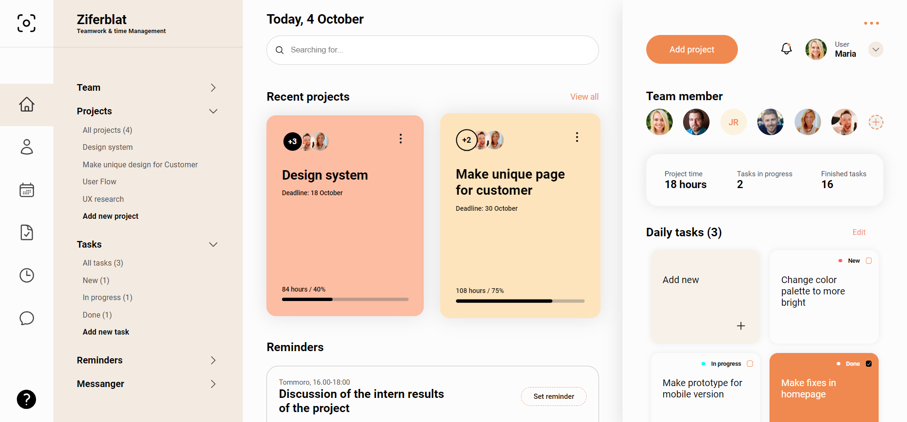
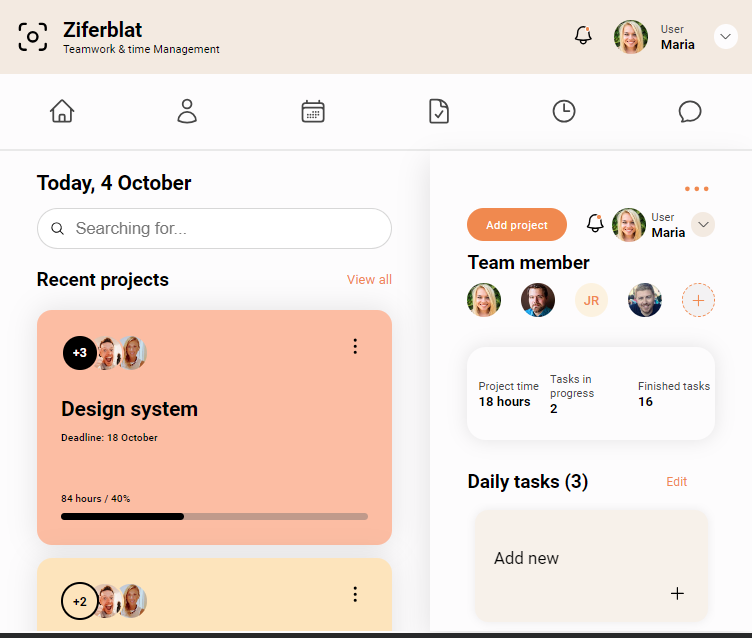
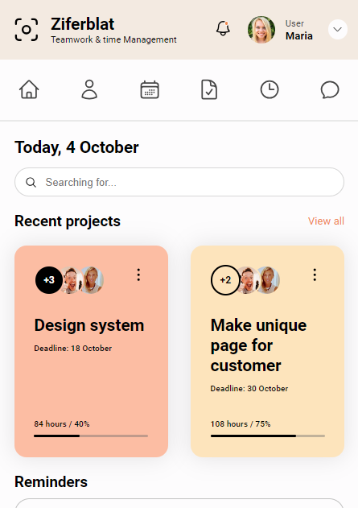

# Dashboard Design

Welcome to my awesome website! This site showcases my projects, portfolio, and other cool stuff.

Check out the live site: [Dashboard](https://test-6-me.netlify.app/)

## About

This website was built using HTML , CSS & SCSS. It features a responsive design, interactive elements, and stunning visuals.

## Usage

To view the website locally or make changes, follow these steps:

1. Clone the repository: `git clone https://github.com/jimmyramani0912/Test-6.git`
2. Navigate to the project directory: `cd Test-6`
3. Open the `index.html` file in your preferred web browser.

## Contributing

Contributions are welcome! If you find any bugs or have suggestions for improvements, please open an issue or submit a pull request.

## Demo

